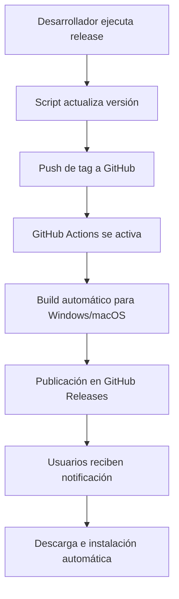

# Sistema de Versionado y Deployment - IP Trade App 2

## 🎯 Resumen Ejecutivo

Esta aplicación Electron cuenta con un **sistema de auto-updates completamente funcional** que permite a los usuarios recibir actualizaciones automáticamente sin intervención manual.

## 🏗️ Arquitectura del Sistema

### Componentes Principales

1. **`electron-updater`** - Maneja la detección, descarga e instalación de actualizaciones
2. **GitHub Releases** - Almacena y distribuye las versiones compiladas
3. **GitHub Actions** - CI/CD automático para build y publicación
4. **Scripts de Release** - Automatización del proceso de versionado

### Flujo de Actualización



## 🚀 Cómo Deployar una Nueva Versión

### Opción 1: Script Automatizado (Recomendado)

```bash
# Para actualizaciones menores (1.0.14 → 1.0.15)
npm run release patch

# Para nuevas funcionalidades (1.0.14 → 1.1.0)
npm run release minor

# Para cambios importantes (1.0.14 → 2.0.0)
npm run release major
```

### Opción 2: Proceso Manual

```bash
# 1. Actualizar versión
npm version patch  # o minor/major

# 2. Push con tags
git push
git push --tags
```

### ⚡ Proceso Automatizado Completo

Cuando ejecutas `npm run release patch`:

1. **Validación** - Verifica que no hay cambios sin commitear
2. **Versionado** - Actualiza automáticamente el `package.json`
3. **Git Tags** - Crea y pushea el tag correspondiente
4. **GitHub Actions** - Se activa automáticamente con el tag
5. **Build Multiplataforma** - Compila para Windows y macOS
6. **Publicación** - Sube los binarios a GitHub Releases
7. **Distribución** - Los usuarios reciben la actualización

## 📱 Experiencia del Usuario

### Notificación de Actualización

Los usuarios ven una tarjeta elegante cuando hay actualizaciones:

- **Estado**: "Nueva actualización disponible"
- **Versión**: Muestra versión actual → nueva versión
- **Acción**: Botón "Descargar actualización"

### Proceso de Descarga

- **Progreso visual**: Barra de progreso con porcentaje
- **Velocidad**: Muestra velocidad de descarga
- **Tamaño**: Información de bytes transferidos/totales

### Instalación

- **Notificación**: "Actualización lista para instalar"
- **Acción**: Botón "Reiniciar aplicación"
- **Proceso**: Instalación automática al reiniciar

## 🔧 Configuración Técnica

### Auto-Updater (electron/main.cjs)

```javascript
const { autoUpdater } = require('electron-updater');

// Configuración automática
if (!isDev) {
  autoUpdater.checkForUpdatesAndNotify();
  autoUpdater.autoDownload = false; // Control manual de descarga
}
```

### Configuración de Build (package.json)

```json
{
  "build": {
    "appId": "com.iptradeapp.app",
    "productName": "IPTRADE APP",
    "publish": [
      {
        "provider": "github",
        "owner": "jometa9",
        "repo": "iptradeapp2"
      }
    ]
  }
}
```

### GitHub Actions (.github/workflows/release.yml)

- **Trigger**: Tags que empiecen con `v*`
- **Plataformas**: Windows y macOS
- **Publicación**: Automática en GitHub Releases

## 🛠️ Scripts Disponibles

```bash
# Desarrollo
npm run electron:dev          # Ejecutar en modo desarrollo
npm run build                 # Build del frontend
npm run electron:build        # Build local (sin publicar)

# Versionado
npm run version:patch         # Solo actualizar versión patch
npm run version:minor         # Solo actualizar versión minor
npm run version:major         # Solo actualizar versión major

# Release completo
npm run release patch         # Release automatizado patch
npm run release minor         # Release automatizado minor
npm run release major         # Release automatizado major

# Build y publicación
npm run electron:build:ci     # Build con publicación (CI)
npm run publish               # Build y publicar manualmente
```

## 🎛️ Interfaz de Usuario

### Componentes Principales

1. **`UpdateCard`** - Tarjeta principal de notificaciones
2. **`useUpdater`** - Hook para manejar estado de actualizaciones
3. **`VersionInfo`** - Muestra versión actual
4. **`UpdateTester`** - Herramientas de testing (solo desarrollo)

### Estados de la UI

- ✅ **Sin actualizaciones**: No se muestra nada
- 🔄 **Verificando**: Spinner de loading
- 📦 **Disponible**: Botón para descargar
- ⬇️ **Descargando**: Barra de progreso
- 🎯 **Lista**: Botón para reiniciar
- ❌ **Error**: Mensaje de error con reintentar

## 🚨 Troubleshooting

### Problemas Comunes

**Error de permisos en GitHub:**
```bash
# Verificar que tienes acceso al repositorio
git remote -v
```

**Build falla en GitHub Actions:**
- Verificar que el `package.json` es válido
- Comprobar que todas las dependencias están en el lock file

**Los usuarios no reciben actualizaciones:**
- Verificar que la app está en producción (no localhost)
- Comprobar que el GitHub Release fue creado correctamente

### Logs y Debugging

```javascript
// Logs en desarrollo (electron/main.cjs)
autoUpdater.on('checking-for-update', () => {
  console.log('Checking for update...');
});

autoUpdater.on('update-available', (info) => {
  console.log('Update available.', info);
});
```

## 📋 Checklist de Release

Antes de cada release, verificar:

- [ ] ✅ Todos los cambios están commiteados
- [ ] 🧪 Testing local completado
- [ ] 📝 Notas de la versión preparadas
- [ ] 🔐 Credenciales de GitHub configuradas
- [ ] 🌐 Conexión a internet estable

## 🔮 Funcionalidades Avanzadas

### Testing de Actualizaciones

En desarrollo, puedes usar el `UpdateTester`:
- Simular estados de actualización
- Probar UI sin releases reales
- Verificar flujo completo

### Configuración de Release Notes

Editar manualmente en GitHub Releases para agregar:
- Changelog detallado
- Nuevas funcionalidades
- Correcciones de bugs
- Instrucciones especiales

### Rollback de Versiones

Si necesitas hacer rollback:
1. Eliminar el release problemático de GitHub
2. Crear nuevo release con versión corregida
3. Los usuarios recibirán la corrección automáticamente

## 🎉 Conclusión

Tu sistema de auto-updates está **completamente funcional** y preparado para producción. Solo necesitas ejecutar `npm run release patch` para deployar nuevas versiones y tus usuarios las recibirán automáticamente.

### Próximos Pasos Recomendados

1. 🚀 **Probar el sistema**: Ejecuta un release de prueba
2. 📚 **Documentar cambios**: Mantén changelog actualizado
3. 🎯 **Monitorear releases**: Vigilar GitHub Actions y uptake de usuarios
4. 🔄 **Iteración regular**: Establecer ciclo de releases regulares
